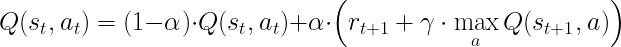

# Deep Reinforcement Learning Nanodegree - Project 1: Navigation

## Introduction
The problem to be solved here is to collect as many yellow bananas as possible in a 3D squared space with both yellow and blue bananas in it. This can be thought as an episodic problem in which the maximization of expected cumulative reward is sought. This can be modelled  as a Q-Learning algorith:

The agent is to learn through the Q-Learning algorithm exploring/exploiting the environment as many times as necessary. The term exploring refers to learn something new (new paths), while exploiting refers to making use of existing knowledge to decide the movements in the environment. Both actions are important, but it has to be decided what is the balance between them, since they are incompatible, so an Epsilon-Greedy Policy is introduced.

The Epsilon-Greedy Policy makes the probability percentage of choosing exploration instead of exploitation decay with time. For this project, it has been selected an initial epsilon of 1, with a finishing one of 0.01 with a decacy of 0.995.

In order to implement the model in the project, as said before, DQN is selected, which differs from traditional Q-Learning in the fact that here the Q action-value functions is represented with a Deep Neural Network (implemented with PyTorch). It has been modeled with 2 layers of 64 hidden units in each layer, being the inputs the state dimension (37) and the output the actions (4). Moreover, experienced replay has to be implemented in order to reduce the inestability introduced by the Neural Network used as action-value function approximator.

## Results
The aiming of the project was to reach an average of rewards of 13, and this is obtained in just 551 episodes (693.76 seconds running with GPU in the Udacity workspace), as it can be seen in the following Figure:

## Future improvements
Although the objective proposed for the project has been achieved, this can be highly improved, and here some future improvements are proposed:

1. More layers in the Neural network
2. Increase the batch size to have a more frequent update of the network
3. Try other models such as Dueling Double Q-Learning
